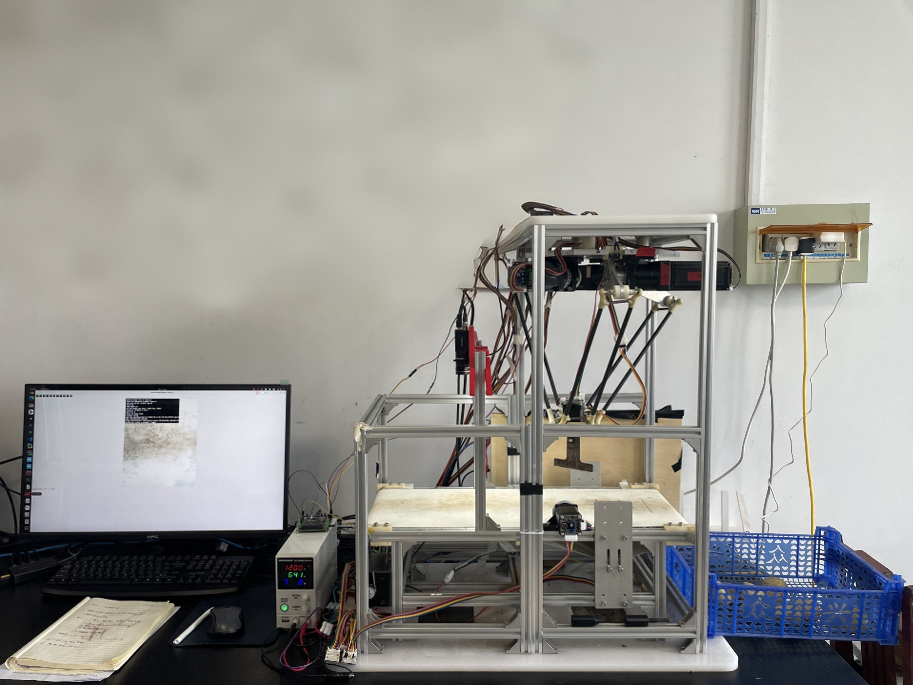
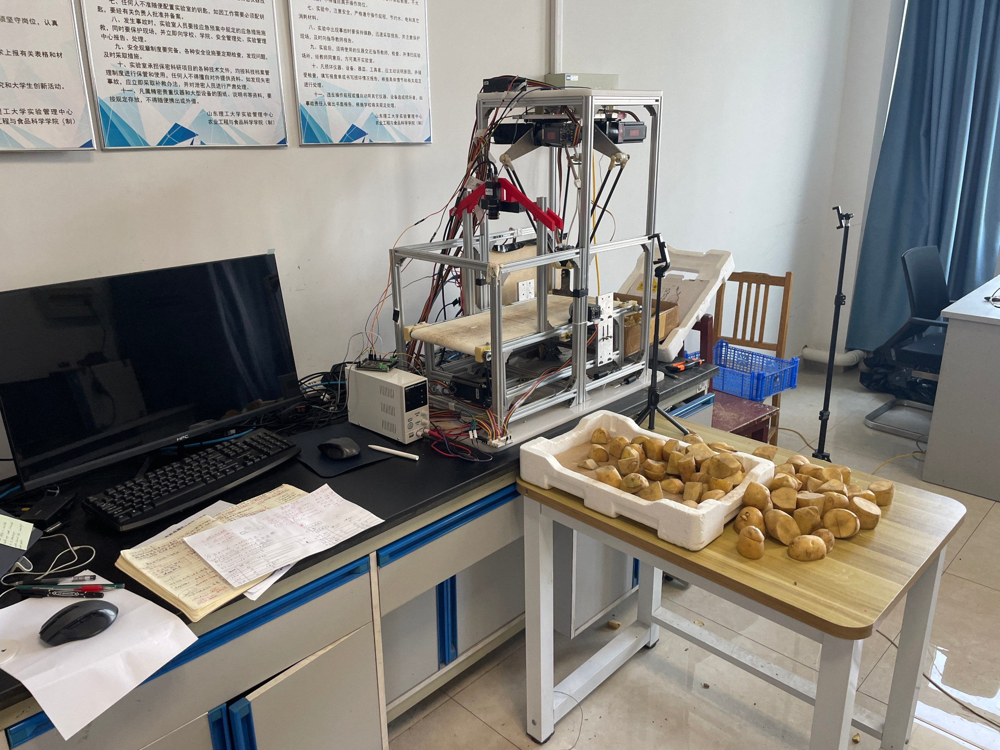
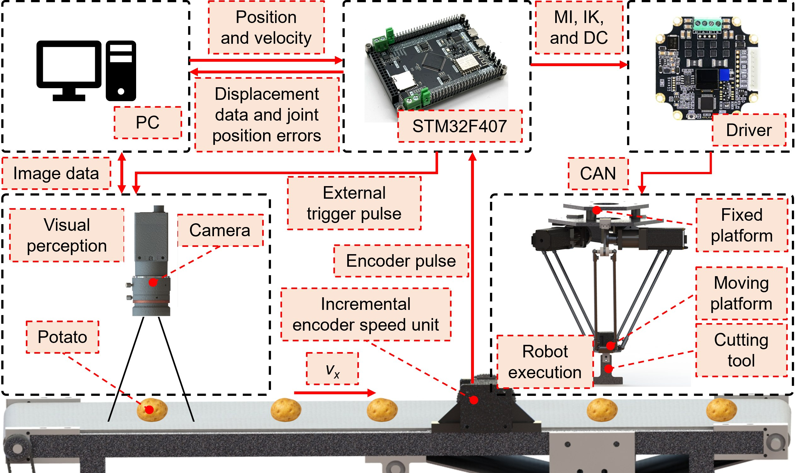
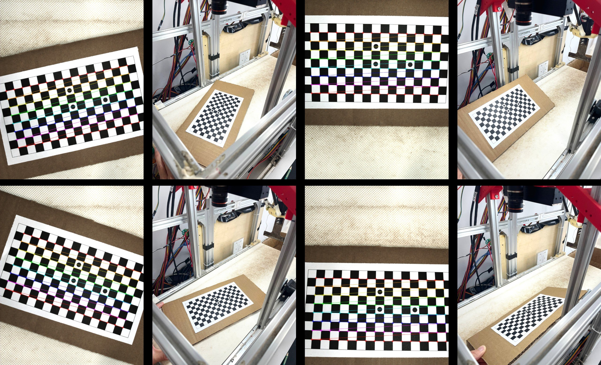
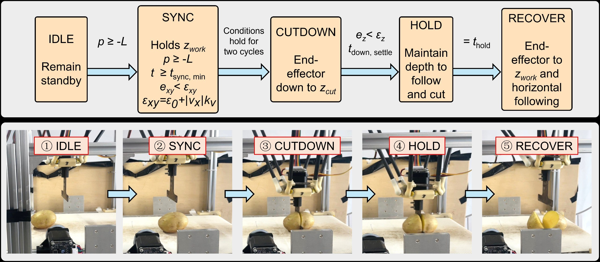

# Potato Robot — Dynamic Cut v2

[中文版](README.zh.md) | English Version

This repository packages the **distance-trigger + encoder-latch + dynamic follow/cut** stack for a Delta potato-cutting cell: core Python algorithms, STM32 flash binaries, and YOLO OBB weights.

## 1. Overview

Vision is synchronized to belt motion with a **hardware encoder latch at camera trigger time**. Targets are tracked into the Delta workspace; cut mode runs a short-follow state machine.

Coordinate chain: `pixel → plane → encoder delta → robot`.

```text
Belt encoder → M850 trigger → Camera + M851 latch → YOLO OBB → Target queue → Dynamic pose → M701 follow / cut
```

## 2. Figures



Laboratory overview of the Delta potato-cutting cell with the host PC and power supply.



Close-up of the cutting platform showing the conveyor, overhead camera, and cut potato samples.



System architecture linking the PC, STM32F407, camera, belt encoder, motor driver, and Delta robot.



Camera calibration on the conveyor belt with checkerboard corner detection overlays.



Cut state machine (`IDLE → SYNC → CUTDOWN → HOLD → RECOVER`) with matching hardware photos.

## 3. Features

- **Distance-triggered capture** — firmware `M850` pulses the camera every N mm; `M852` for manual triggers.
- **Hardware latch alignment** — `M851` returns encoder snapshot `E0` at trigger time.
- **YOLO OBB detection** — weights in `code/yolo_weights/best.pt`.
- **Target queue & association** — same-frame merge, cross-frame matching, anchor correction, mileage prune (`code/core_dynamic_cut/`).
- **Encoder Kalman filter** — control velocity from position E (firmware V is log-only).
- **Run modes (host design)** — `monitor` / `follow` / `cut`.
- **Cut state machine** — `IDLE → SYNC → CUT_DOWN → HOLD → RECOVER`.
- **Conveyor control** — `M815` / `M802`.

## 4. Repository layout

| Path | Description |
|------|-------------|
| [`code/core_dynamic_cut/`](code/core_dynamic_cut/) | Core algorithm modules (Chinese comments) |
| [`code/firmware/`](code/firmware/) | STM32F407 flash binaries + firmware README |
| [`code/yolo_weights/`](code/yolo_weights/) | YOLO OBB weights (`best.pt`) |

## 5. How to use

### 5.1 Flash firmware

See [`code/firmware/README.md`](code/firmware/README.md). From `code/firmware/`:

```bash
openocd -f stlink.cfg -c "program core_stm32f407.elf verify reset exit"
```

Host port after flash: USB CDC (e.g. `/dev/ttyACM0`).

### 5.2 Load YOLO weights

```python
from pathlib import Path
from ultralytics import YOLO

model = YOLO(str(Path("code/yolo_weights/best.pt")))
```

### 5.3 Use core algorithms

Modules under [`code/core_dynamic_cut/`](code/core_dynamic_cut/) implement encoder velocity filtering, dynamic pose / workspace windows, target association, and the cut state machine. Import them from that package in your host application. Details: [`code/core_dynamic_cut/README.md`](code/core_dynamic_cut/README.md).

## 6. Run modes (host design)

| Mode | Behavior |
|------|----------|
| `monitor` | Vision + latch + coordinate chain only; no M701 motion |
| `follow` | Send M701 dynamic follow targets in the workspace window |
| `cut` | Short-follow cut state machine |

## 7. Key parameters

Typical host / algorithm knobs (see `CutConfig` / `QueueConfig` in `code/core_dynamic_cut/` and firmware `M850` / `M700`):

| Parameter | Role |
|-----------|------|
| `trigger_interval_mm` | Belt distance between camera pulses |
| `workspace_limit_x/y_mm` | Safe follow window half-size |
| `cut_station_x_mm` | Nominal cut station X in robot frame |
| `cut_sync_start_distance_mm` / lead | When to lock sync and when to start Z down |
| `follow_feed_mm_s` / `follow_feed_z_mm_s` | XY / Z follow feeds (firmware `M700`) |
| `conveyor_speed_mm_s` | Belt speed (`M815`) |
| association / memory gates | Cross-frame matching and target lifetime |

## 8. Related docs

- Core algorithms: [`code/core_dynamic_cut/README.md`](code/core_dynamic_cut/README.md)
- Firmware: [`code/firmware/README.md`](code/firmware/README.md)
- Weights: [`code/yolo_weights/README.md`](code/yolo_weights/README.md)
- Chinese version: [`README.zh.md`](README.zh.md)
